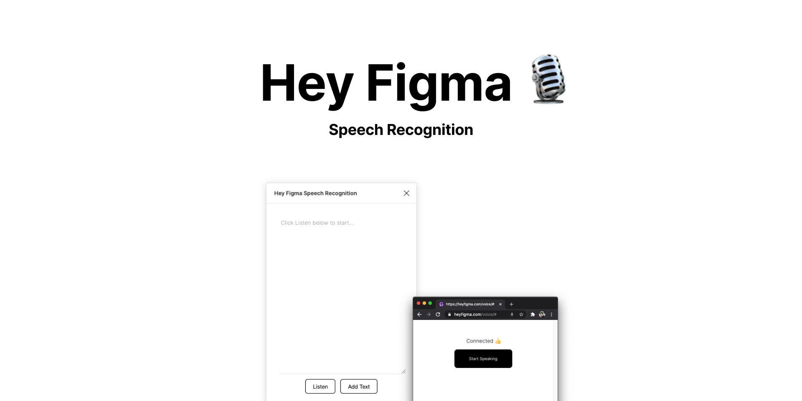

# Hey Figma Speech Recognition

Let you insert a text from your voice using speech recognition. Click Open Voice > Start Speaking to start the speech recognition. Once finished, it will automagically add text into the plugin. Click add text to add it on the canvas.

How it works:

- It will open a new browser window, because Figma doesn't have permission for microphone.
- The web app will recognize your voice locally in your browser using webkit SpeechRecognition, so you need to use modern browser
- Lastly, it will send the text result back to the plugin via web socket
